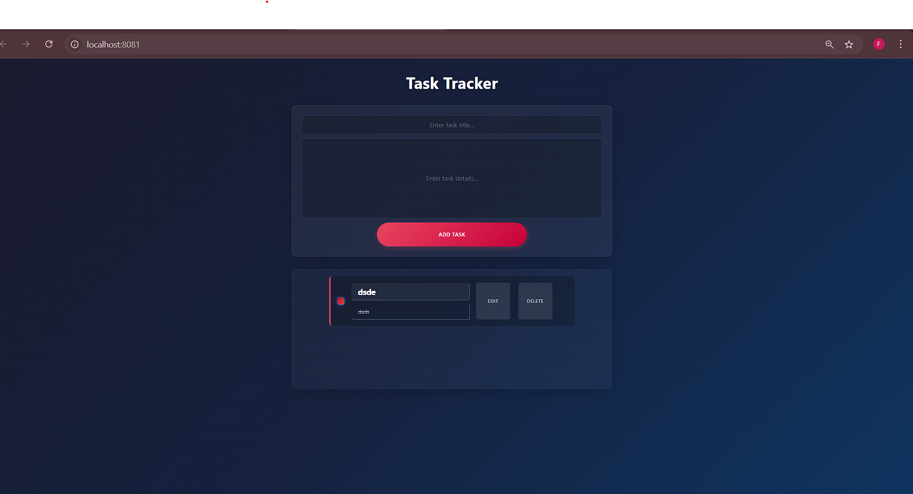
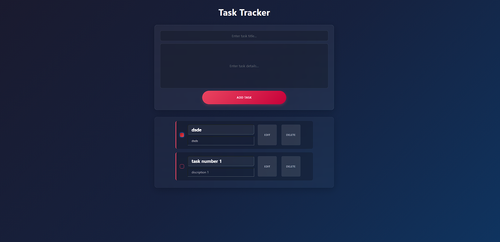
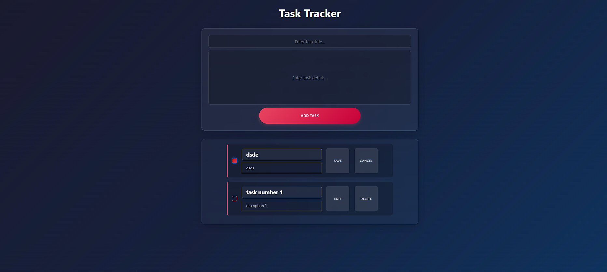

# Task Management Application

This is a simple task management application built with TypeScript. It allows users to create, edit, delete, and mark tasks as completed. Tasks are stored in the browser's `localStorage` for persistence.

## Features

- Add new tasks with a title and body.
- Edit existing tasks.
- Delete tasks.
- Mark tasks as completed using a checkbox.
- Persist tasks in the browser's `localStorage`.

---

#Screenshots 
=====================================================================================================================================================================


|--------------------|-------------------|--------------------|
|         | |
|--------------------|-------------------|--------------------|

 |        | 
 


## Prerequisites

Before you begin, ensure you have the following installed on your system:

- [Node.js](https://nodejs.org/) (v14 or later)
- [npm](https://www.npmjs.com/) (comes with Node.js)
- [TypeScript](https://www.typescriptlang.org/) (globally installed)

---

## Installation

Follow these steps to set up and run the project locally:

1. **Clone the Repository**:
   ```bash
   git clone <repository-url>
   cd <repository-folder># Task tracker app 

> ✨ Bootstrapped with Create Snowpack App (CSA).

## Available Scripts

### npm start

Runs the app in the development mode.
Open http://localhost:8080 to view it in the browser.

The page will reload if you make edits.
You will also see any lint errors in the console.

### npm run build

Builds a static copy of your site to the `build/` folder.
Your app is ready to be deployed!
Install Dependencies: Install the required dependencies using npm:

Compile TypeScript: Compile the TypeScript code to JavaScript:

Run the Application: Open the index.html file in your browser to run the application.

Project Structure
.
├── src
│   ├── [index.ts](http://_vscodecontentref_/1)          # Main TypeScript file
│   ├── styles.css        # CSS file for styling
│   └── index.html        # HTML file for the application
├── dist
│   └── index.js          # Compiled JavaScript file
├── [package.json](http://_vscodecontentref_/2)          # Project metadata and dependencies
├── [tsconfig.json](http://_vscodecontentref_/3)         # TypeScript configuration
└── [README.md](http://_vscodecontentref_/4)             # Project documentation
